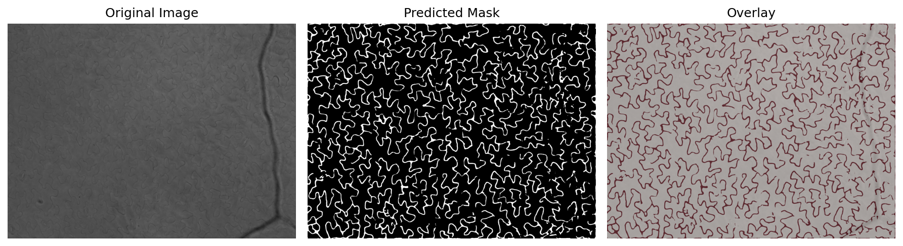

# Pavement Cell Segmentation

This repository contains the implementation of the research paper titled **"A Simple Approach to Pavement Cell Segmentation"** by Rostislav Shepel, Andrew Romanowski, and Mario Valerio Giuffrida.

## Abstract

This study focuses on segmenting pavement cells from microscopy images of Arabidopsis thaliana plants, which is critical for linking cellular traits to overall plant performance. Differently than the current state-of-the-art, we propose a simple, easy-to-train approach using partially annotated datasets to address the challenges of irregular pavement cell shapes. Specifically, we employed U-Net and DeepLabV3 architectures for segmentation, showing that both models can perform well despite the constraints. Post-segmentation, we used PaCeQuant to extract phenotyping data, demonstrating the effectiveness of our method. The results indicate that U-Net provides a slightly closer match to the true mask, though DeepLabV3 also performs robustly. This approach facilitates more accurate and efficient plant phenotyping, contributing to sustainable agricultural practices.

## 🚀 Try it Online

Experience the pavement cell segmentation tool directly in your browser with our **interactive Hugging Face demo**:

**[🤗 Live Demo on Hugging Face Spaces](https://huggingface.co/spaces/RostiS/pavement_cell_segmentation)**

Simply upload your pavement cell images and get instant segmentation results without any setup required!

## Example Results



_Example showing original pavement cell image (left), predicted segmentation mask (center), and overlay visualization (right)_

## Setup

### Automated Setup (Recommended)

Use the setup script to automatically install dependencies and create necessary directories:

```bash
./setup.sh
```

The setup script will:
- Check Python version compatibility (3.8+ required)
- Install all dependencies from `requirements.txt`
- Create necessary directories (`images/input/`, `images/output/`, `images/output/debug/`)
- Verify the installation
- Optionally create a virtual environment

### Manual Setup

If you prefer manual setup:

```bash
# Install dependencies
pip install -r requirements.txt

# Create directories
mkdir -p images/input images/output images/output/debug
```

## Quick Start - CLI Usage

### Process Images with CLI

The fastest way to process your pavement cell images:

```bash
# Run setup first (if not done already)
./setup.sh

# Process images from a folder
python src/process_images.py images/input images/output

# With custom parameters
python src/process_images.py images/input images/output \
    --model models/unet_model.onnx \
    --device cuda \
    --overlap 64 \
    --threshold 0.9 \
    --debug
```

### CLI Options

- `input_folder`: Directory containing images to process
- `output_folder`: Directory to save segmentation masks
- `--model`: Path to ONNX model file (default: models/unet_model.onnx)
- `--device`: Processing device - cpu or cuda (default: cpu)
- `--overlap`: Overlap between tiles (default: 64)
- `--threshold`: Segmentation threshold (default: 0.9)
- `--debug`: Save debug visualizations
- `--intersection-blend`: Use intersection blending for overlaps (default: True). Only pixels where ALL overlapping tiles agree are kept
- `--average-blend`: Use legacy averaging blending for overlaps instead of intersection blending
- `--verbose`: Enable detailed logging

**Notes:** 

- Tile size is fixed at 256×256 pixels for optimal model performance.
- The algorithm supports nested directories - you can organize images in subfolders within `images/input/` and the directory structure will be preserved in the output.

### Docker Usage

#### Using Docker Compose (Recommended)
```bash
# Place your images in ./images/input/
mkdir -p images/input images/output

# Run with CPU
docker-compose up pavement-segmentation

# Run with GPU (if available)
docker-compose up pavement-segmentation-gpu
```

#### Using Docker directly
```bash
# Build the image
docker build -t pavement-segmentation .

# Run processing
docker run -v $(pwd)/images/input:/app/input \
           -v $(pwd)/images/output:/app/output \
           pavement-segmentation \
           /app/input /app/output --device cpu
```


## Running the Notebooks

### 1. Google Colab

Both notebooks are compatible with Google Colab. To run the notebooks:

1. Upload the notebook to your Google Drive.
2. Open the notebook in Google Colab.
3. Install necessary dependencies if not already installed (these are typically managed within the notebooks).
4. Run the cells sequentially.

### 2. Local Environment

If you prefer to run the notebooks locally:

1. Clone this repository:
    ```bash
    git clone https://github.com/Rosti35/pavement-cell-segmentation
    cd pavement-cell-segmentation
    ```
2. Run the setup script to install dependencies and create directories:
    ```bash
    ./setup.sh
    ```
3. Run the Jupyter notebooks using Jupyter Lab or Jupyter Notebook:
    ```bash
    jupyter notebook notebooks/Unet_pavement__cell.ipynb
    jupyter notebook notebooks/DeepLabV3_pavement__cell.ipynb
    ```

## Dependencies

All required dependencies are listed in `requirements.txt` and include:
- PyTorch (torch, torchvision)
- NumPy, Pillow, Matplotlib
- scikit-image, tqdm
- ONNX Runtime (for fast inference)

The setup script automatically installs all dependencies:
```bash
./setup.sh
```

For manual installation:
```bash
pip install -r requirements.txt
```


This will create sample images and process them to demonstrate the workflow.

## Citation

If you use this code or find it useful, please cite the original paper:
```bib
@inbook{inbook,
author = {Shepel, Rostislav and Romanowski, Andrew and Giuffrida, Mario},
year = {2025},
month = {05},
pages = {240-251},
title = {A Simple Approach to Pavement Cell Segmentation},
isbn = {978-3-031-91834-6},
doi = {10.1007/978-3-031-91835-3_16}
}
```
## License

This repository is licensed under the MIT License. See the [LICENSE](LICENSE) file for more details.

## Contact

For any questions or issues, please contact:

- Rostislav Shepel: [efyrs5@nottingham.ac.uk](mailto:efyrs5@nottingham.ac.uk)
- Andrew Romanowski: [andres.romanowski@wur.nl](mailto:andres.romanowski@wur.nl)
- Mario Valerio Giuffrida: [valerio.giuffrida@nottingham.ac.uk](mailto:valerio.giuffrida@nottingham.ac.uk)
